  

  

Unity와 C#으로 클라이언트 개발을 시작해 웹·API 연동과 운영 문제까지 다뤄왔습니다. 문제가 생기면 화면에서 출발해 코드, API, 로그와 배포 환경을 차례로 확인하는 편입니다.

요즘은 AI 도구를 실제 개발 흐름에 붙이고, 결과를 믿기 위해 어떤 검증이 필요한지 정리하고 있습니다.

  
  
  

---

## `$ focus --now`

> **클라이언트 · 웹/API · 운영 검증 · AI 개발 흐름**

- **Unity Client** — JSON 기반 오브젝트 구조, WebGL과 Android 빌드 환경
- **Web & API** — 인증·세션·재시도와 클라이언트/API 경계
- **Live Operations** — 화면, 로그, 배포 파일과 실제 동작을 연결한 원인 추적
- **AI Engineering** — 에이전트 하네스, 작업 루프와 결과 검증

## `$ stack --list`

  

 

  
  
  
  
  
  

## `$ github --signal`

  <a href="https://github.com/cheondi">
    <picture>
      <source media="(prefers-color-scheme: dark)" srcset="https://raw.githubusercontent.com/cheondi/cheondi/output/github-stats-dark.svg" />
      <source media="(prefers-color-scheme: light)" srcset="https://raw.githubusercontent.com/cheondi/cheondi/output/github-stats-light.svg" />
      
    </picture>
  </a>
  <a href="https://github.com/cheondi?tab=repositories">
    <picture>
      <source media="(prefers-color-scheme: dark)" srcset="https://raw.githubusercontent.com/cheondi/cheondi/output/top-langs-dark.svg" />
      <source media="(prefers-color-scheme: light)" srcset="https://raw.githubusercontent.com/cheondi/cheondi/output/top-langs-light.svg" />
      
    </picture>
  </a>

  <a href="https://github.com/DenverCoder1/github-readme-streak-stats">
    <picture>
      <source media="(prefers-color-scheme: dark)" srcset="https://raw.githubusercontent.com/cheondi/cheondi/output/streak-dark.svg" />
      <source media="(prefers-color-scheme: light)" srcset="https://raw.githubusercontent.com/cheondi/cheondi/output/streak-light.svg" />
      
    </picture>
  </a>

<picture>
  <source media="(prefers-color-scheme: dark)" srcset="https://github-readme-activity-graph.vercel.app/graph?username=cheondi&amp;bg_color=0d1117&amp;color=c9d1d9&amp;line=58a6ff&amp;point=79c0ff&amp;area=true&amp;hide_border=true" />
  <source media="(prefers-color-scheme: light)" srcset="https://github-readme-activity-graph.vercel.app/graph?username=cheondi&amp;bg_color=ffffff&amp;color=24292f&amp;line=0969da&amp;point=54aeff&amp;area=true&amp;hide_border=true" />
  
</picture>

## `$ log --featured`

<strong>경험과 대표 기록 펼쳐보기</strong>

### Unity와 클라이언트

- [충격적인 오브젝트 생성법](https://cheondi.github.io/2023/02/18/shocking-object-creation.html)
- [Unity WebGL·Android 빌드 차이](https://cheondi.github.io/2024/03/23/unity-webgl-android-build.html)

### API와 운영 검증

- [API 워크플로와 재시도 경계](https://cheondi.github.io/2026/06/28/api-workflow-retry-boundary.html)
- [코드·테스트·배포를 잇는 검증 기록](https://cheondi.github.io/2026/08/10/evidence-before-ai-answer.html)

### AI 개발 흐름

- [AI 에이전트 개발의 현실적인 도입 순서](https://cheondi.github.io/2026/08/11/agent-engineering-adoption-order.html)

## `$ contributions --animate`

<picture>
  <source media="(prefers-color-scheme: dark)" srcset="https://raw.githubusercontent.com/cheondi/cheondi/output/github-contribution-grid-snake-dark.svg" />
  <source media="(prefers-color-scheme: light)" srcset="https://raw.githubusercontent.com/cheondi/cheondi/output/github-contribution-grid-snake.svg" />
  
</picture>

---

  이 README는 AI를 활용해서 적어봤습니다.

